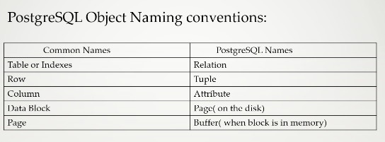

# database-expertise

## Basic Info 

<ul>
      <li> Open source </li>
      <li> Started Journey in 1986 </li>
       <li> It offer ACID {atomicy , consistency , Isolation , Durability } </li>
      <li> Object Relational Database Management {Means it has class and inheritance like features in query } </li>
       
</ul>

### Some Important Naming conventions with respect to other databases 



### Limits of postgresql 


### Installation 

```
yum install postgresql-server -y
```

### make it initialize 

```
[root@node230 ~]# postgresql-setup  initdb
Initializing database ... OK
```

### starting service 

```
[root@node230 ~]# systemctl start postgresql
[root@node230 ~]# systemctl status postgresql
● postgresql.service - PostgreSQL database server
   Loaded: loaded (/usr/lib/systemd/system/postgresql.service; disabled; vendor preset: disabled)
   Active: active (running) since Mon 2023-05-29 14:35:45 IST; 1s ago
```

### making service persistent 

```
[root@node230 ~]# systemctl enable  postgresql
Created symlink from /etc/systemd/system/multi-user.target.wants/postgresql.service to /usr/lib/systemd/system/postgresql.service.
```

## COnnecting from as client 

```
[root@node230 ~]# su - postgres 
-bash-4.2$ 
-bash-4.2$ psql 
psql (9.2.24)
Type "help" for help.

postgres=# \du
                             List of roles
 Role name |                   Attributes                   | Member of 
-----------+------------------------------------------------+-----------
 postgres  | Superuser, Create role, Create DB, Replication | {}


postgres-# \q
-bash-4.2$ logout
```
